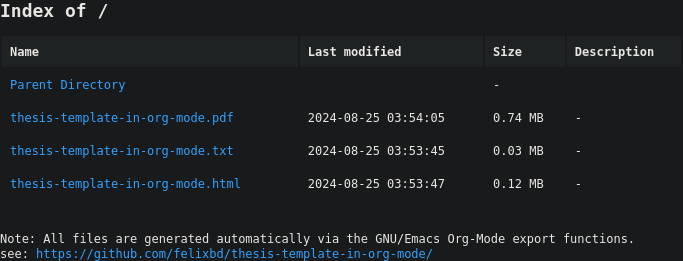

thesis in org-mode
==================

1. `nix-shell`
2. `make`
3. `make o`
4. (`make c`)

see [final pdf](./out/thesis-template-in-org-mode.pdf)

see `out/index.html`

<table>
  <tr>
    <td></td>
    <td></td>
    <td></td>
  </tr>
</table>
